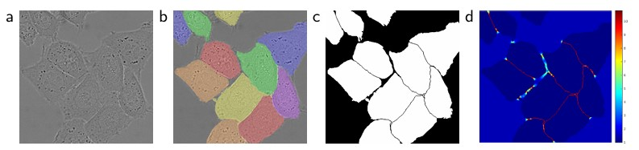
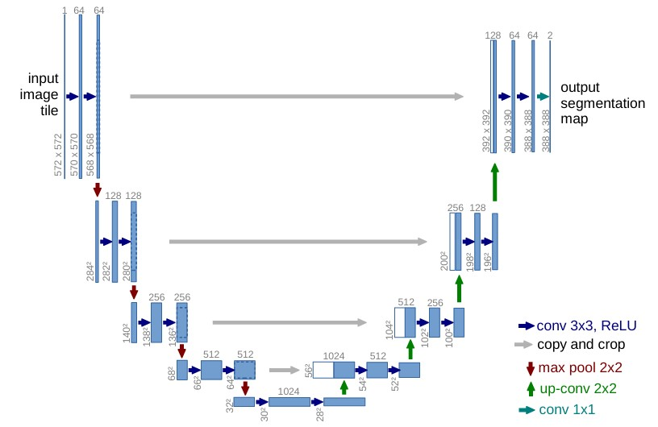
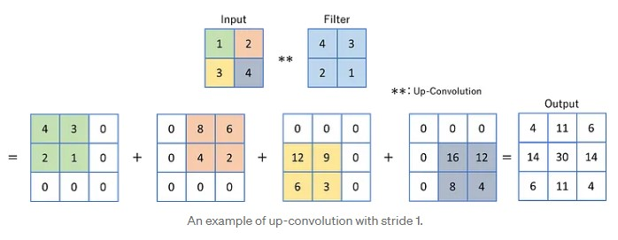

## Introduction

In recent years, deep learning has dramatically transformed image processing, with the **U-Net** model standing out as one of the most impactful architectures. Introduced in 2015 by Olaf Ronneberger’s team, U-Net was originally developed for biomedical image segmentation. It has since gained popularity in numerous applications where precise segmentation is crucial. Unlike traditional convolutional neural networks (CNNs) designed for image classification, U-Net excels at identifying object boundaries, making it a powerful tool in healthcare.

In this blog, we’ll discuss image segmentation and explore how U-Net’s unique structure—characterized by a contracting path for capturing context and an expansive path for precise localization—enables high-performance segmentation in complex tasks.

>It is highly recommended that you are familiar with CNNs before delving into this article.

## Challenges in Image Segmentation
In the past, when the amount of data was not large enough, traditional Machine Learning methods gave quite accurate and effective results. However, as time went on, the data exploded, the requirements became higher and higher (from identifying objects with just a "bounding box" to needing a better border to cover the object), although traditional methods could be used to analyze the data, the efficiency gradually decreased, unable to keep up with the growth rate of data. Image Segmentation task faced several significant challenges.
- **Precision and Accuracy**: Some traditional methods struggled to segment images precisely, especially those with varying textures, complex structures, or noise. Techniques such as thresholding, region-based segmentation, and edge detection have been proposed; however, these methods do not deliver the necessary detail and accuracy for complex tasks like medical imaging.

## The process of Image Segmentation
Several deep learning models, such as U-Net, Mask R-CNN, and Fully Convolutional Networks (FCN), have been used for image segmentation. Although these models have different architectures, they generally follow a similar procedure for segmenting images.

- **Data Preparation**: Having a substantial amount of annotated data is essential for training a deep learning model for image segmentation. This process involves labeling images at the pixel level and assigning a class label to each pixel.
- **Pre-processing**: This step involves resizing images and augmenting the dataset (see [Data Augmentation](#data-augmentation)) to enhance the model’s robustness. Additionally, it includes normalizing the images to improve learning efficiency.
- **Model Training**: You train the model on the annotated dataset, allowing it to learn how to classify each pixel of the input image into the appropriate class.
- **Post-processing**: After the model predicts the pixel classes, you implement post-processing steps, such as eliminating small clusters of misclassified pixels or utilizing Conditional Random Fields (CRFs) to enhance the results.
- **Visualization**: To visualize the segmentation during the post-processing step, you assign a specific color to each unique class value. This color mapping is arbitrary and selected to maximize contrast between different classes, facilitating easier visual distinction.

## Advantages of U-Net
**High Accuracy with Limited Data:** U-Net delivers impressive results even with small training datasets, thanks to its architectural design and data augmentation techniques.

**Precise Localization:** The use of skip connections to integrate low-level and high-level features facilitates accurate localization of object boundaries.

**Fast and Efficient:** U-Net's fully convolutional architecture allows for the efficient processing of large images while ensuring quick segmentation speeds.

## Model Architecture

The U-Net architecture is composed of two main components: a **Contracting Path** and a **Expanding Path**.

 - **Contracting path (Encoder)**: aims to decrease the spatial dimensions of the image, while also capturing relevant information about the image.
 - **Expanding path (Decoder)**: aims to upsample the feature map and produce a relevant segmentation map using the patterns learnt in the contracting path.

>As you may notice, the U-Net architecture quite resembles an **Encoder-Decoder** architecture, which coincidentally makes a U shape, hence the name.

### Contracting Path
The contracting path uses a combination of *convolution* and *pooling layers* to extract and capture features within an image, at the same time, reducing its spatial dimensions.

- **Convolutional Layers**: Convolutional layers are the key components of the contracting path. In the original model proposed by Olaf Ronneberger, each block consists of two consecutive 3×3 convolutional layers, each followed by a Rectified Linear Unit (ReLU) activation function.
- **Activation Functions**: A ReLU activation function is applied after each convolution operation. This is important because ReLU introduces non-linearities into the model, enabling it to learn more complex patterns in the data that cannot be captured by linear transformations alone.
- **Max Pooling**: After the convolutional layers, a 2×2 max pooling operation with a stride of 2 is applied. This process reduces the spatial dimensions by half while retaining abstract information, making the model robust to small shifts and distortions.
- **Feature Doubling**: After each max pooling step, the next convolutional layer doubles the number of filters. For instance, if a layer begins with 64 feature channels, it will have 128 channels following the next pooling and convolution operations. Doubling the number of feature channels helps the network maintain or even enhance its capacity to represent information, despite the reduction in spatial resolution. This is crucial since reducing the image size increases the risk of losing important details.

### Expanding Path
The expanding path combines learned features and progressively upsamples the input feature map using convolution and up-convolution operations, ultimately producing a segmentation map.
Each block includes:

- Up-sampling of the feature map to increase image size.
- A 2×2 convolution to halve the number of feature channels.
- Two 3×3 convolutions followed by ReLU activation.

### Output
At the final layer of the Convolutional Neural Network, a 1×1 convolution is used to map the feature vector (usually consisting of 64 components at the last stage of the expansive path) to the specified number of classes for segmentation.

## What are Up-Convolutions and Skip Connection?

### Up-Convolutions
An up-convolution, commonly referred to as deconvolution or transpose convolution, is a technique used to upsample images and restore spatial information.

The most effective method for performing up-convolutions involves expanding and duplicating each element from the input feature map to match the size of the filter. This process upsamples the input, after which the filter is applied to each of these expanded regions.

### Skip Connection
Skip connections play a crucial role in the effectiveness of U-Net. By directly merging feature maps from the contracting path with those from the expanding path, U-Net integrates low-level detail with high-level contextual information throughout the network.

**Recover Spatial Hierarchies:** These connections enable U-Net to concatenate high-resolution features from the contracting path with the upsampled outputs from the expanding path. This integration aids in recovering spatial hierarchies that may have been lost during pooling operations in the contracting phase.

## Data Augmentation
In situations like medical imaging, where annotated samples are limited, data augmentation becomes essential.

**Data augmentation** refers to the technique of artificially enlarging a training set by applying transformations such as rotations, elastic deformations, and scaling. This process enhances model generalization and robustness by exposing it to a variety of image types. Here are some techniques:

-   **Biased crop:** Randomly crops patches with a bias towards including foreground.
-   **Zoom:** Randomly zooms in on the image.
-   **Flipping of Image**
-   **Gaussian Noise:** Adds random noise to the input.
-   **Gaussian Blur**
-   **Brightness and Contrast:** Randomly adjusts brightness and contrast.

## Author's note
> **Source of Knowledge and Purpose of the Blog:**  
> The knowledge in this blog is referenced and compiled from reliable sources on the Internet. Writing this blog helps me to remember and understand the topic more deeply, while also sharing knowledge with others who are interested.

## References
- Olaf, R., Philipp, F., Thomas, B., [*U-Net: Convolutional Networks for Biomedical Image Segmentation*](https://arxiv.org/abs/1505.04597), 2015
- Nico Klingler, [*U-Net: A Comprehensive Guide to Its Architecture and Applications*](https://viso.ai/deep-learning/u-net-a-comprehensive-guide-to-its-architecture-and-applications/), 2024
- Alejandro Ito Aramendia, [*The U-Net : A Complete Guide*](https://medium.com/@alejandro.itoaramendia/decoding-the-u-net-a-complete-guide-810b1c6d56d8),  2024